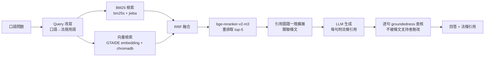

# tw-longcare-rag：台灣長照法規 RAG 諮詢系統

> 每句回答都附法條引用；查不到明確法源，就誠實說「查無明確法源」並建議撥打 1966 長照專線。

**TL;DR (English).** A Traditional-Chinese RAG system for Taiwan's long-term care regulations, built end-to-end on Taiwan's open-source model stack (TAIDE embedding + TAIDE LLM via Ollama), with hybrid retrieval (BM25 + dense + rerank), contextual retrieval, a citation graph for cross-article expansion, and sentence-level groundedness checking — every sentence in an answer carries a legal citation, and the system honestly refuses when no legal basis is found. Benchmarked against international baselines (bge-m3, gemma-3-12b-it). Live demo: (Phase 7 補上)

## 為什麼做這個專案（動機草稿，待作者潤飾）

前陣子協助家中長輩申請長照服務，才發現相關規定散落在好幾部法規裡：母法在《長期照顧服務法》，申請與給付在另一部辦法，機構管理又是一部，還有《老人福利法》彼此交錯。政府的 1966 專線與各縣市照管中心都很有幫助，但每次想「自己先查清楚再去問」，就得在全國法規資料庫的好幾個頁面之間跳來跳去。所以我想做一個小工具：用口語的繁體中文發問，它去查正式法條、每一句回答都標明出自哪一條，查不到就老實說查不到。同時，這也是我對台灣開源模型生態（TAIDE 與社群微調模型）的一次完整實戰——從 embedding、檢索到生成全部採用台灣在地模型，並與國際基準模型在同一評估集上正面對照。

> **本工具為非官方個人專案，僅供參考。正式資訊請以衛生福利部公告與 1966 長照服務專線為準。**

## 系統架構

> Phase 2 已實作 Query 改寫 → hybrid 檢索 → RRF → rerank → 生成（含引用）；
> 引用圖譜擴展（Phase 4）與逐句 groundedness 查核（Phase 3）尚待實作。



## 模型選型（台灣模型 vs 基準模型）

| 角色 | 台灣模型（主力） | 基準對照 | 備註 |
|---|---|---|---|
| Embedding | taide/embeddinggemma-GTAIDE-300m-2605（768 維；query/document 分離 prompt） | BAAI/bge-m3（1024 維） | GTAIDE 以法規語料微調，與本專案高度對口 |
| 生成 LLM（地端） | taide/Gemma-3-TAIDE-12b-Chat-2602（Ollama） | google/gemma-3-12b-it | 另可切換雲端 provider |
| Reranker | —（台灣生態系目前無本土 reranker，故採多語模型） | BAAI/bge-reranker-v2-m3 | |

雲端 provider（可切換）：Gemini 與 OpenAI，模型字串一律由 `.env` 設定（見 `.env.example`，含落日註記）。

## 快速開始

```powershell
uv sync
Copy-Item .env.example .env   # 填入金鑰
uv run python scripts/fetch_laws.py     # 抓五法條文 → data/laws.json
uv run python scripts/build_index.py --confirm-cost   # 建索引（含 contextual 摘要，先看成本估算）
uv run python -m twlongcare.cli "阿嬤請看護政府有補助嗎" --provider ollama
```

`--provider` 可切換 `ollama`（地端 TAIDE 12B，預設）/ `gemini` / `openai`。
開發者：clone 後執行一次 `git config core.hooksPath .githooks` 啟用公開文案守門 hooks。

### 範例輸出（`--provider gemini`）

```
$ uv run python -m twlongcare.cli "喘息服務一年有幾天" --provider gemini

關於您詢問喘息服務的給付頻率，根據現行法規，喘息服務額度是每年給付一次
[長期照顧服務申請及給付辦法 §12]。

不過，法規中並未直接規定「一年有幾天」，若您需要確認具體的服務天數或額度
細節，建議您可以撥打 1966 長照服務專線洽詢，將有專人為您說明。

引用條文出處：
  《長期照顧服務申請及給付辦法》第 12 條  https://law.moj.gov.tw/LawClass/LawSingle.aspx?pcode=L0070059&flno=12
  ...（其餘檢索到的條文）

⚠️ 本工具為非官方個人專案，僅供參考；正式資訊以衛生福利部公告與 1966 專線為準。
```

## 誠實拒答與逐句查核

（Phase 3 補上：陷阱題的 grounding 開/關對照 transcript）

## 評估結果

（Phase 5 補上：檢索對照實驗表、生成端盲測表、成本實績；完整矩陣見 docs/eval.md）

## 關鍵套件版本

以 `uv lock` 鎖定；下表為規劃期查證的目標版本（2026-07-20，隨開發以 uv.lock 為準更新）：

| 套件 | 版本 | 套件 | 版本 |
|---|---|---|---|
| python | ≥3.11 | chromadb | 1.5.9 |
| langchain | 1.3.14 | bm25s | 0.3.9 |
| langchain-google-genai | 4.2.7 | sentence-transformers | 5.6.0 |
| langchain-openai | 1.3.5 | jieba | 0.42.1 |
| langchain-ollama | 1.1.0 | gradio（Phase 6） | 6.x |
| torch | 2.11.0+cu128 | deepeval（Phase 5） | 4.1.x |
| | | networkx（Phase 4） | 3.6.1 |

註：向量庫直接呼叫 `chromadb`（不經 `langchain-chroma` 包裝），因 hybrid 檢索需要對候選集做精細控制；LLM 呼叫仍全數走 LangChain（見 PLAN.md D9）。

評估框架選型：deepeval 優先——ragas 0.4.3 目前與 LangChain 1.x 生態有未解的 import 衝突（上游 issue #2745），詳見 `docs/research/2026-07-audit/stack-compat.json`。

## 成本透明

全程雲端 API 預算 < US$1（快取齊全、重跑不重複計費）。實際花費隨各 Phase 記錄於 PROGRESS.md：
Phase 2 contextual 摘要（205 條、208 chunks，gemini-3.1-flash-lite）估算 $0.13〜0.41，已完成生成並快取。
Phase 5 完成後在此回填全程實績總表。

## 資料來源與授權

- 法規條文資料取自法務部「全國法規資料庫」（https://law.moj.gov.tw/ ）官方 Open API 及政府資料開放平臺（https://data.gov.tw/dataset/18289 、https://data.gov.tw/dataset/18290 ），依《政府資料開放授權條款－第1版》規定利用並註明出處；法規內容以全國法規資料庫公布之最新版本為準。
- **資料快照版本：2026-07-10**（Open API 整包 UpdateDate；官網最新異動最多可能領先整包約一個月）。條數已與官網逐法核對一致，並抽樣比對條文原文。

| 法規（pcode） | 條數 | 最新異動 | 備註 |
|---|---:|---|---|
| 長期照顧服務法（L0070040） | 72 | 2021-06-09 | 含 8-1 等 6 個增訂條 |
| 老人福利法（D0050037） | 58 | 2025-08-01 | |
| 長期照顧服務法施行細則（L0070043） | 15 | 2019-10-24 | |
| 長期照顧服務機構設立許可及管理辦法（L0070044） | 38 | 2022-02-10 | |
| 長期照顧服務申請及給付辦法（L0070059） | 22 | 2025-06-19 | 部分修正條文自民國 115 年起分階段施行（詳 laws.json meta 註記） |

- 已知限制：部分辦法之「附表」（如照顧組合表）為獨立附件、不在條文文字內，目前版本不納入語料。
- 程式碼授權：MIT License。

## 開發紀錄

- 開發藍圖與決策：[PLAN.md](PLAN.md)（Decision Log、Phase 規劃、風險對策）
- 進度日誌：[PROGRESS.md](PROGRESS.md)
- 規劃期外部資源查證（開工前先實測：法規 API、模型 gated 狀態、套件相容性、模型字串與成本）：[docs/research/2026-07-audit/](docs/research/2026-07-audit/)
