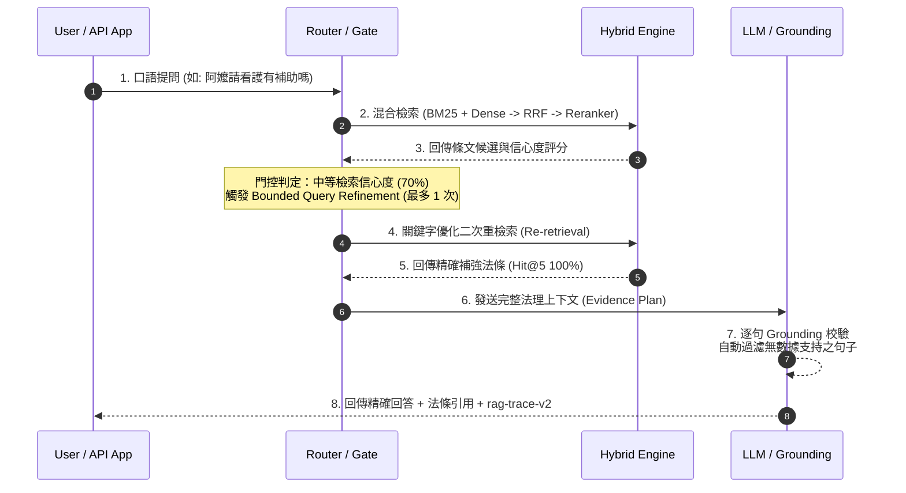

# TW Longcare RAG

[](https://github.com/kuotunyu/tw-longcare-rag/actions/workflows/ci.yml)


[](https://github.com/kuotunyu/tw-longcare-rag/releases/tag/production-rag-v1)
[](LICENSE)

本專案為針對台灣長照法規設計的可量測、可追蹤且具備「誠實拒答」機制之 Production-grade RAG 系統。架構結合 BM25 + Dense + RRF 混合檢索、Cross-Encoder Reranker、Typed Router、有界修正檢索 (Bounded Corrective Retrieval) 與逐句 Grounding 校驗，確保回答可精確回查法規條文原文，且在證據不足時絕不胡亂生成。

> **免責聲明**：本工具為非官方個人學術專案，不構成法律或長照申請建議。正式資訊請以衛生福利部公告、全國法規資料庫與 1966 長照服務專線為準。

[線上 Demo](https://huggingface.co/spaces/steven0226/tw-longcare-rag) · [Production RAG 設計文檔](docs/production-rag.md) · [完整評估報告](docs/eval.md)

---

## 系統核心機制

1. **多階段混合檢索 (Hybrid Retrieval & Reranking)**：
   整合 BM25 關鍵字檢索、Dense 向量檢索與 Reciprocal Rank Fusion (RRF)，並透過 Cross-Encoder Reranker 與 Contextual Retrieval 進行最終重排序。
2. **條文關聯拓樸與跨章節擴展 (Citation Graph & RAPTOR-lite)**：
   採用 RAPTOR-lite 進行章節結構化摘要，並透過 Citation Graph 一階擴展捕捉跨法條關聯性。
3. **有界修正與誠實拒答門控 (Pre-Generation Gate)**：
   依據檢索信心度決策：高信心度直接回答、中信心度發起最多一次 Query Refinement、低信心度或無證據時轉介 1966 專線誠實拒答。
4. **生成後逐句校驗 (Post-Generation Grounding)**：
   生成內容與原始檢索法條進行獨立模型評級 (Grading) 與逐句比對，自動剔除缺乏證據支持的句子。

---

## 系統架構與檢索時序

### 有界修正檢索與 Grounding 檢索時序



---

## 檢索與生成評測結果

鎖定評測集包含 31 題可回答題與 13 題不可回答題，在獨立 Calibration Set 上完成門檻設定：

| 評測模式 / 部署策略 | Recall@5 / MRR | 拒答 Precision / Recall | p50 / p95 生成前延遲 | 系統特性說明 |
|---|---:|---:|---:|---|
| **Current Baseline (預設)** | **93.5% / 0.785** | **84.6% / 84.6%** | **219 ms / 236 ms** | 生產環境預設模式，超低延遲且性能極度穩定 |
| **Refinement Enabled (實驗)** | **100% / 0.871** | 80.0% / 92.3% | 1.28 s / 5.71 s | 精確度提升，但延遲呈倍數增加，設為 Opt-in 實驗組 |

- **路由準確率 (Route Accuracy)**：30/30 (100%)。
- **DeepEval 雲端獨立評測**：Faithfulness 1.000、Answer Relevancy 0.957。
- 完整詳細數據與陰性結果剖析見 [docs/production-rag.md](docs/production-rag.md)。

---

## 法規知識庫管理 (Living Knowledge Base)

系統建置可追蹤版本之法規知識庫（包含長期照顧服務法、老人福利法及其施行細則與給付辦法，共 5 部法規、205 條）：
- **自動化 Diff 與驗證**：追蹤官方法規 SHA-256 簽章，自動識別變更條文。
- **原子切換與 Regression 防護**：僅在自動化檢索 Regression 測試通過後方可原子切換 (Atomic Swap) 啟用新版知識庫。

---

## 快速開始

需求：Python 3.11+、`uv`、地端 Ollama (TAIDE / Llama3)。

### 1. 環境初始化與檢索索引建置

```powershell
# 安裝依賴與設定環境變數
uv sync
copy .env.example .env

# 下載法規與建置混合檢索索引
uv run python scripts/fetch_laws.py
uv run python scripts/build_index.py --confirm-cost
```

### 2. 執行命令列對話與測試 (183 passed)

```powershell
# 執行 183 項測試單元
uv run python -m pytest -q

# CLI 命令列問答
uv run python -m twlongcare.cli "阿嬤請看護政府有補助嗎" --provider ollama

# 啟動 Web UI (預設 localhost:7860)
uv run python app.py
```
