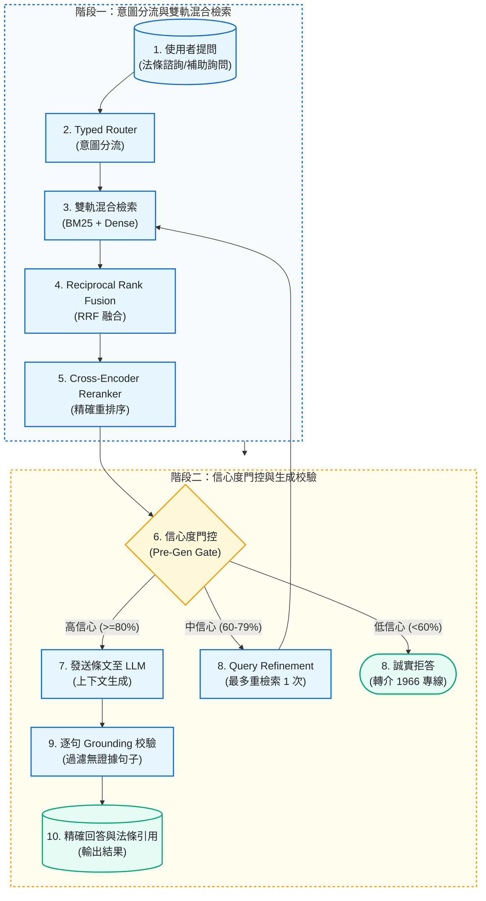
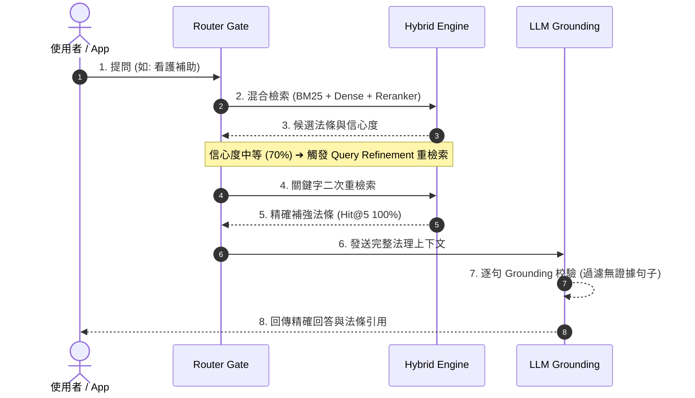

# TW Longcare RAG

[](https://github.com/kuotunyu/tw-longcare-rag/actions/workflows/ci.yml)

[](https://github.com/kuotunyu/tw-longcare-rag/releases/tag/production-rag-v1)

[](LICENSE)

> **Frozen / Portfolio Complete**：`v1.0.0` 是本作品的最終發佈版本；不再新增
> RAG 功能，也不以此 repository 持續更新法規。知識庫固定為
> `2026-07-17-e941dcc3e345` 的 versioned historical snapshot。

本專案是以台灣長照法規歷史快照為範圍的 RAG 作品展示。它實作 BM25 + Dense +
RRF 混合檢索、Cross-Encoder Reranker、Typed Router、有界修正檢索與逐句
Grounding，並保留可重現的評估與 trace 證據。系統能提供法條出處並在部分證據
不足情境拒答，但實測仍有漏拒、誤拒與引用覆蓋限制。

> **使用邊界**：這是非官方、已凍結的 portfolio prototype，不是現行法規來源，
> 也不是法律、長照資格、給付或申請決策工具。請勿以輸出直接作成權益決定；
> 正式資訊請查衛生福利部公告、全國法規資料庫或洽 1966 長照服務專線。

[線上 Demo](https://huggingface.co/spaces/steven0226/tw-longcare-rag) · [Deployment lineage](docs/deployment-lineage.md) · [Portfolio closure audit](docs/portfolio-closure.md) · [Production RAG 歷史設計文檔](docs/production-rag.md) · [完整評估報告](docs/eval.md)

---

## 系統核心機制

1. **多階段混合檢索 (Hybrid Retrieval & Reranking)**：
   整合 BM25 關鍵字檢索、Dense 向量檢索與 Reciprocal Rank Fusion (RRF)，並透過 Cross-Encoder Reranker 與 Contextual Retrieval 進行最終重排序。
2. **條文關聯拓樸與跨章節擴展 (Citation Graph & RAPTOR-lite)**：
   採用 RAPTOR-lite 進行章節結構化摘要，並透過 Citation Graph 一階擴展捕捉跨法條關聯性。
3. **有界修正與誠實拒答門控 (Pre-Generation Gate)**：
   依據檢索信心度決策：高信心度直接回答、中信心度發起最多一次 Query Refinement、低信心度或無證據時轉介 1966 專線誠實拒答。
4. **生成後逐句校驗 (Post-Generation Grounding)**：
   生成內容與原始檢索法條進行獨立模型評級 (Grading) 與逐句比對，自動剔除缺乏證據支持的句子。

---

## 系統架構與檢索時序

### 1. Production RAG 雙軌混合檢索與門控架構



### 2. 有界修正檢索與 Grounding 檢索時序 (Sequence Diagram)



---

## 檢索與生成評測結果

鎖定評測集包含 31 題可回答題與 13 題不可回答題，在獨立 Calibration Set 上完成門檻設定：

| 評測模式 / 部署策略 | Recall@5 / MRR | 拒答 Precision / Recall | p50 / p95 生成前延遲 | 系統特性說明 |
|---|---:|---:|---:|---|
| **Current Baseline (預設)** | **93.5% / 0.785** | **84.6% / 84.6%** | **219 ms / 236 ms** | Portfolio Demo 保留的預設路徑 |
| **Refinement Enabled (實驗)** | **100% / 0.871** | 80.0% / 92.3% | 1.28 s / 5.71 s | 精確度提升，但延遲呈倍數增加，設為 Opt-in 實驗組 |

- **路由準確率 (Route Accuracy)**：30/30 (100%)。
- **DeepEval 雲端獨立評測**：Faithfulness 1.000、Answer Relevancy 0.957。
- 完整詳細數據與陰性結果剖析見 [docs/production-rag.md](docs/production-rag.md)。

---

## 版本化知識庫機制（目前凍結）

repository 保留一套**手動觸發**的版本化流程：以 SHA-256 辨識條文差異，建立
immutable snapshot，並要求 locked retrieval regression 通過後才原子切換索引。
這是已測試的維護機制，不代表目前存在排程、監控或自動法律更新服務。

Portfolio 最終快照包含 5 部法規、205 條；官方 package metadata 日期為
`2026-07-17`，corpus hash 為
`e941dcc3e3454cc262e66667f5d227b32291fbde9ed689c0374347d41d456c35`。
該次 refresh 與 `2026-07-10` 快照的 205 條內容相同，屬 metadata-only rebind；
closure 沒有重抓或更新任何法律內容。

---

## 快速開始

需求：Python 3.11+、`uv`、地端 Ollama (TAIDE / Llama3)。

### 1. 環境初始化與檢索索引建置

```powershell
# 安裝依賴與設定環境變數
uv sync
copy .env.example .env

# 使用 repository 內封存的法律快照建置混合檢索索引
uv run python scripts/build_index.py
```

### 2. 啟動 Web UI Demo 與執行單元測試

```powershell
# 啟動 Gradio Web 介面
uv run python app.py

# 執行單元與整合測試
uv run pytest -q tests
```

---

## 授權與聲明

本專案採 [MIT License](LICENSE)。數據集與長照法規文字請依衛生福利部與全國法規資料庫條款使用。
