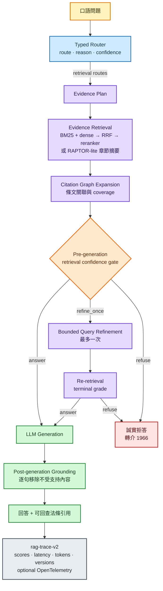

# TW Longcare RAG

<div align="center">

**可量測、可追蹤、懂得拒答的台灣長照法規 RAG**

[](pyproject.toml)
[](#驗證與重現)
[](https://github.com/kuotunyu/tw-longcare-rag/releases/tag/production-rag-v1)
[](LICENSE)

[線上 Demo](https://huggingface.co/spaces/steven0226/tw-longcare-rag) ·
[Production RAG 設計](docs/production-rag.md) ·
[完整評估](docs/eval.md) ·
[開發決策](PLAN.md)

</div>

用白話中文查詢台灣長照法規，取得可回查原文的回答；證據不足時不硬答。
本專案保留既有 BM25 + dense + RRF + reranker 架構，在其上加入 typed routing、
bounded corrective retrieval、逐句 grounding、完整 trace 與版本化 Living
Knowledge Base，沒有為了框架展示而重寫成 LlamaIndex。

> [!IMPORTANT]
> 本工具是非官方個人專案，不構成法律或長照申請建議。正式資訊請以
> 衛生福利部公告、全國法規資料庫與 1966 長照服務專線為準。

## 核心能力

| 能力 | 實作 |
|---|---|
| 精準檢索 | BM25 + dense + RRF、cross-encoder reranker、contextual retrieval |
| 跨條文理解 | RAPTOR-lite 章節摘要、citation graph 一階擴展、必要條文 coverage |
| 有界修正 | 5 種 typed route、多訊號 retrieval confidence gate、最多一次 query refinement |
| 可信回答 | 生成前 grading 與生成後逐句 grounding 分離；不受支持句子移除或拒答 |
| Production ops | `rag-trace-v2` JSONL、OpenTelemetry adapter、token/latency budget、可重現 locked eval |
| Living KB | 法規 snapshot/hash/diff、idempotent ingestion、增量 embedding、regression 後原子切換 |

## 架構

下圖聚焦需要檢索的主路徑；`no_retrieval` 與 `structured` 會由 typed router
直接交給確定性 handler，不進入檢索與生成。



Route contract 固定為 `no_retrieval`、`structured`、`single_hop`、
`global_or_multi_hop`、`corrective_candidate`。Adaptive 層只會輸出
`answer`、`refine_once` 或 `refuse`；refinement 上限為 1，預設 token budget
為 16,000，沒有無上限 agent loop 或 web-search fallback。

## 實測結果

Locked eval 使用固定的 31 題可回答題與 13 題不可回答題；threshold 只在獨立
calibration set 決定。結果顯示 refinement 改善 retrieval，但代價與退化也很明顯：

| 模式 | Recall@5 / MRR | Refusal P / R | p50 / p95 生成前延遲 | Loop 啟動 / rescue / regression |
|---|---:|---:|---:|---:|
| **current baseline** | 93.5% / 0.785 | 84.6% / 84.6% | 219 / 236 ms | 0 / 0 / 0 |
| confidence gate only | 93.5% / 0.785 | 38.2% / 100% | 219 / 236 ms | 0 / 0 / 0 |
| refinement enabled | 100% / 0.871 | 80.0% / 92.3% | 1.28 / 5.71 s | 77.3% / 8.8% / 2.9% |
| full adaptive route | 100% / 0.871 | 80.0% / 92.3% | 1.28 / 5.71 s | 77.3% / 8.8% / 2.9% |

因此公開 API 與 HF Space **維持 `current_baseline` 為預設**；Adaptive 模式保留為
明確 opt-in 實驗，不宣稱已全面勝過 baseline。其他已實跑結果：

- Route accuracy：30/30。
- Baseline retrieval：Hit@5 93%、MRR 0.79（30 題）。
- DeepEval：Faithfulness 1.000、Answer Relevancy 0.957（30 題、雲端生成與獨立 judge）。
- 44 題本機 TAIDE 端到端遙測：p50/p95 8.56/20.16 秒；嚴格 citation proxy
  僅 16.1%，顯示地端 12B 的句尾引用格式仍是已知弱點。

完整 raw results、評估覆蓋率、負面結果與採用決策見
[Production RAG 設計與實測](docs/production-rag.md)。

## 快速開始

需要 [Python 3.11+](https://www.python.org/) 與
[uv](https://docs.astral.sh/uv/)；地端生成另需 Ollama 與 `.env.example`
內設定的 TAIDE 模型。

```powershell
uv sync
Copy-Item .env.example .env
uv run python scripts/fetch_laws.py
uv run python scripts/build_index.py --confirm-cost
uv run python -m twlongcare.cli "阿嬤請看護政府有補助嗎" --provider ollama
uv run python app.py
```

網頁介面預設在 <http://localhost:7860>。`--provider` 可切換 `ollama`、
`gemini` 或 `openai`；雲端模型字串與金鑰都由 `.env` 管理。

在不改變 baseline 回答的情況下蒐集 gate 分布：

```powershell
uv run python -m twlongcare.cli "問題" --shadow-adaptive
uv run python scripts/summarize_traces.py --since-days 7
```

若要明確啟用實驗模式：

```powershell
uv run python -m twlongcare.cli "問題" `
  --adaptive-mode full_adaptive_route `
  --max-refinements 1 `
  --max-total-tokens 16000
```

## Living Knowledge Base

目前 snapshot 為 **2026-07-17，共 5 部法規、205 條**。更新流程永久保存官方
原始版本與逐條 hash，產生 new/changed/deleted diff；候選索引只有在 locked
retrieval regression 通過後才會原子啟用，失敗時保留上一個可用版本。

```powershell
uv run python scripts/fetch_laws.py --refresh
uv run python scripts/build_index.py --versioned --regression-min-recall 0.90
```

<details>
<summary>涵蓋法規</summary>

- 長期照顧服務法
- 老人福利法
- 長期照顧服務法施行細則
- 長期照顧服務機構設立許可及管理辦法
- 長期照顧服務申請及給付辦法

</details>

法規來源為法務部
[全國法規資料庫](https://law.moj.gov.tw/) Open API 與政府資料開放平臺
（[法規目錄](https://data.gov.tw/dataset/18289)、
[法規內容](https://data.gov.tw/dataset/18290)）。部分獨立附表目前不在語料內。

## 驗證與重現

```powershell
uv run pytest -q
uv run python scripts/run_production_eval.py --all
uv run python scripts/check_production_readiness.py
```

評估資料固定版本、raw trace 與結果均保留在 `docs/eval/production/`。不要依
locked test 結果回頭調 threshold；要調整 gate 時只使用 calibration set。

## 文件

- [Production RAG 架構、trace、budget 與 Living KB](docs/production-rag.md)
- [完整 retrieval / generation / refusal 評估](docs/eval.md)
- [設計決策與階段規劃](PLAN.md)
- [實作與實驗日誌](PROGRESS.md)
- [法條引用圖譜（互動版）](docs/assets/law_graph.html)

---

**English:** A production-oriented Traditional-Chinese RAG system for Taiwan
long-term-care regulations, featuring hybrid retrieval, typed routing, bounded
corrective retrieval, sentence-level grounding, structured observability, and
versioned knowledge-base updates. Adaptive retrieval remains opt-in because the
locked evaluation showed a real quality–latency trade-off.

MIT License.
